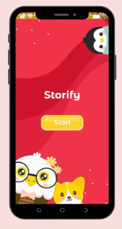
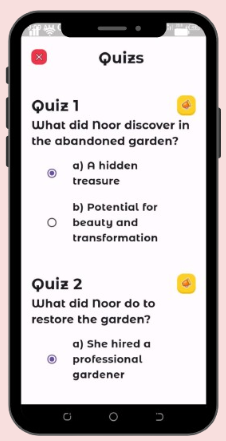
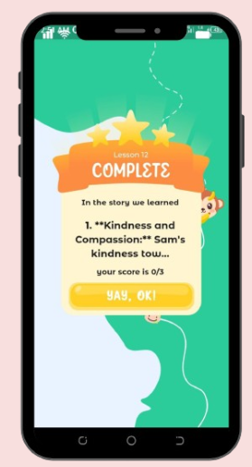
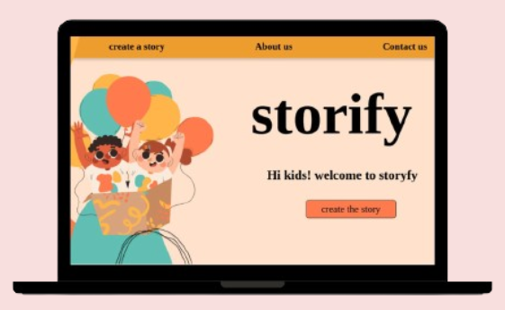
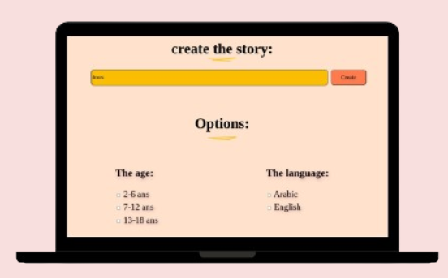
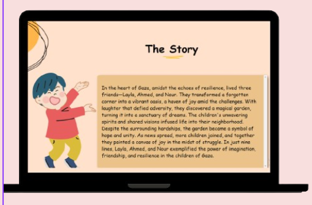
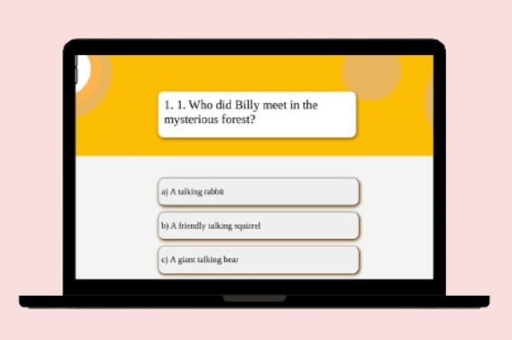
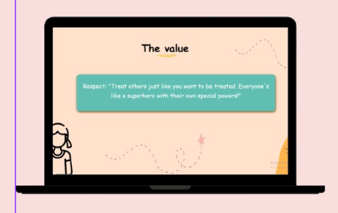

# Storify
Storify is our (**skill-issue team**) submission for the BATNA Hackathon 2023. It's an app that targets kids from the age of 4 to 18, aiming to provide them with meaningful stories using generative AI.       
If you want to try it out, you should include your API keys.

## Features
- Gemini: Generative text for story generation using prompts.
- Hugging Face: Generative images AI to create visuals from the story.
- Hugging Face: Image-to-caption AI for generating stories from images.
- flutter_ttf: Utilized to convert stories into audio.

# Hackathon Thoughts
For anyone interested in detailed thoughts on the hackathon, you can check this [link](./hackathon-thoughts.md)         
As a recap:     
- Organizers: You did your job perfectly.
- Participants: Great people, and I hope we meet again next year.
- Final words: The best first hackathon, exceeded my expectations. Thank you! :)

## Screenshots 
for the [presentation](./presentation.pptx)     
to lazy ppl like me (XD) who prefer not to compile/download/use the app  :)     
### Mobile:
     
     
     
     
     

### Web:
     
     
     
     
     

# Credits:
- Special thanks to the Figma community for providing the designs since we are noobs in UI/UX.
    - [Mobile Design](https://www.figma.com/file/7hFfvcVfhIpB18j9kMzA1y/Kindergarten-Learning-UI---Mobile-App-(Community)?type=design&node-id=1-2&mode=design&t=NzgNHDAHg65yDjzA-0)  
    - Web Design: I joined later in the process so i dont have a link, but the design originated from the Figma community. 
- Appreciation to [Kind-Unes](https://github.com/Kind-Unes) for the heavy lifting. Despite differing beliefs and a lot of ups and downs, thank you. 
- Thanks to Batoure, the beginner web developer; I hope you learned a lot from our collaboration.
- Gratitude to the organizers for handling nerds like us.

